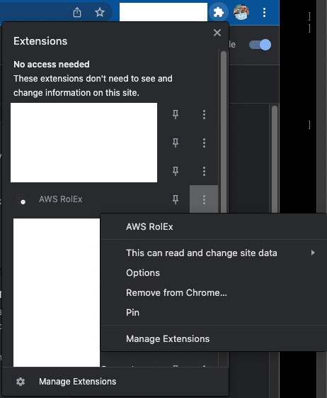
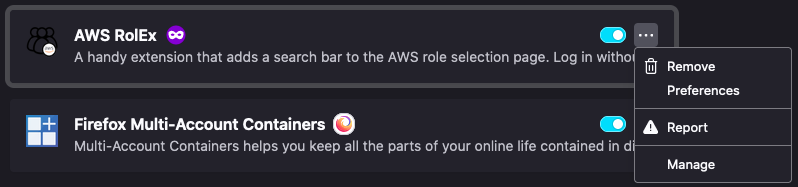

# aws-rolex

AWS Role Extension (AWS RolEx) - A little browser extension to make the role selection page a bit more tolerable :)

aws-rolex can be found here:
* Chrome Web Store: https://chrome.google.com/webstore/detail/aws-rolex/mielpcboppjdjnfdkilgbhkbipambfgo
* Firefox Add-ons: https://addons.mozilla.org/en-US/firefox/addon/aws-rolex/

## Changing the Background Image

Don't like the picture of Luna The Cat? Fine, I won't hold it against you... Much 😂

(Thanks to [@yanxiangw](github.com/yanxiangw) for this feature!)

### Google Chrome

Open your extensions, and click the three dots next to AWS RolEx:

Hit **Options** and you're off!

You can also do this by navigating to [chrome://extensions](chrome://extensions), then clicking **Details** on the AWS RolEx extension

### Firefox

Head on over to [about:addons](about:addons), or use the menu to navigate to **Add-ons and themes**.

Find AWS RolEx in the list, click the three dots to open the menu, then select **Preferences**

## Bundled Dependencies

* [FuseJS](https://fusejs.io/) - [CDN Download](https://cdn.jsdelivr.net/npm/fuse.js/dist/)